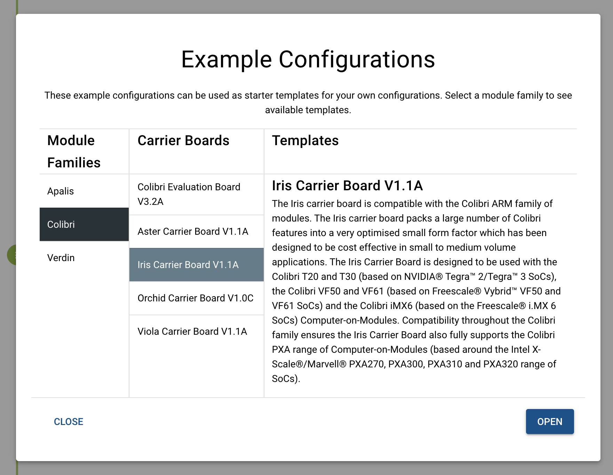

# Table of Contents

1. [Overview](#Overview)
2. [System Requirements](#System-Requirements)
3. [The User Interface](#The-User-Interface)
    1. [Create a Blank Configuration Workspace](#Create-a-Blank-Configuration-Workspace)
    2. [Create Configuration From A Template](#Create-Configuration-From-A-Template)
4. [Exporting Your Configuration](#Exporting-Your-Configuration)
5. [Importing Saved Configuration](#Importing-Saved-Configuration)

# Overview #

[Pinout Designer application](https://pinout.torizon.io/#/) is a tool designed for pin muxing of Toradex SoC modules, providing the ability to compare the interfaces of different module types within the same family (Apalis, Colibri and Verdin). This document highlights some of the features of the application to help you get started as quickly as possible. You can access the latest version of the application at https://pinout.torizon.io

# System Requirements #

The minimum requirement to use the application is as follow: 

- Any modern web browser (Chrome, Firefox, Safari, Microsoft edge, etc.)

- Internet connection

# The User Interface #

The user interface (UI) follows the same design conventions like many commonly used modern web application. It comprises of three main sections: header, sidebar and main content area.  

# Creating New Pin Configuration #

## Create a Blank Configuration Workspace ##

To create a blank pin configuration:

1. Click  “New Project” on the sidebar. You will be presented with modules selection dialog.
2. Select module family
3. Select desired modules

4. Click “Continue”. A blank pin configuration project workspace will be created

## Create Configuration From A Template ##

1. Open the sidebar and click “New From Template”
2. From template selection dialog box, select the module family. Once you select a module family, you will see available carrier boards for that module family.
3. Select desired carrier board template.
4. You should now see a description for the selected carrier board template and a “Open“ button to confirm your selection.

5. If you are satisfied with your selection, click “Open” to create pin configuration based on that selection.

# Exporting Your Configuration #

1. Click “Export Project” from the sidebar and this will open “Pin Configuration Export Wizard”

2. From the project export wizard, choose desired export format and click “Continue”
3. If you have selected “Excel spreadsheet” as the export format in the previous step, you will be presented with a view to “Select Fields to Export”. This is where you can further customize what columns from the pin configuration table to be exported. Click continue after making your selection.

4. Specify the name for the file to be exported in the “File name” input and click "Finish". 

5. The project will be exported into a file in the format you selected in the previous steps and the exported file will be downloaded to your system download path.

# Importing Saved Configuration #

To import a previously exported XML pin configuration file:

1. Click “Import Project” from the sidebar. You will need to confirm the action if you already have modules selected in the workspace.
2. Select the XML file containing the pin configuration that you want to import.

3. If the configuration file was created using a different version of the application, you will see a dialog box showing the version conflict. Click “Ok” to proceed.

4. You should see the summary of the configuration file you selected. Click “Continue” to import the pin configuration.

